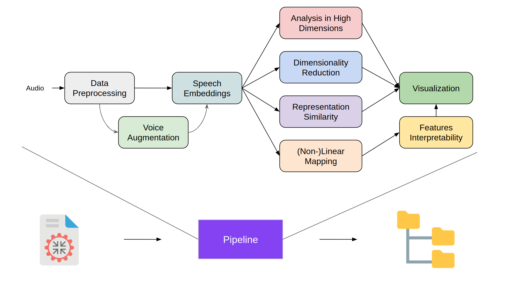

# Voice Identity Perception Project

This repository hosts the work done concerning studying self-supervised speech models that generate robust audio representations, with the aim to better understand what these models are actually encoding.

The current workflow (as shown below) comprises different kinds of analyses to further probe the model's speech embeddings and identify patterens, correlations and invariances with conventional handcrafted (DSP-based) acoustic features.

